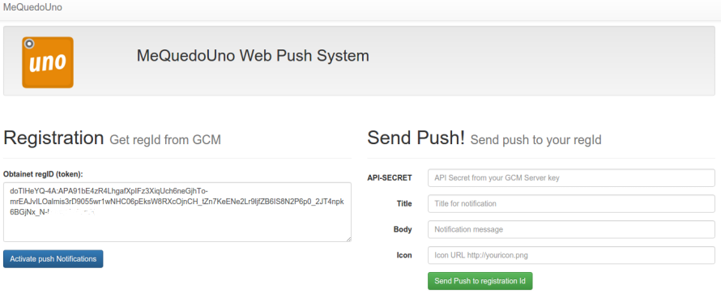

Welcome webPush! 
===================

WebPush example of integration for Mequedouno .

From this example you can register in GCM , registrationID receive and send a push that will be received by your browser.

You can also control the content push from the example of the auxiliary API.

----------

Configuratión
-------------
Remember!, to work , you need basic support PHP 5.5 and SSL certificate for authentication Vaido .

Edit config/config.php and set your API_SECRET for GCM.
Edit manifest.json and add your sender_id (project number in GCM)

Enjoy!